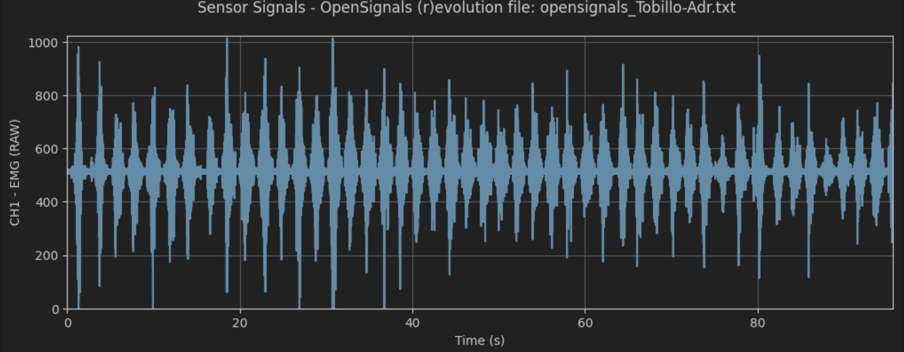
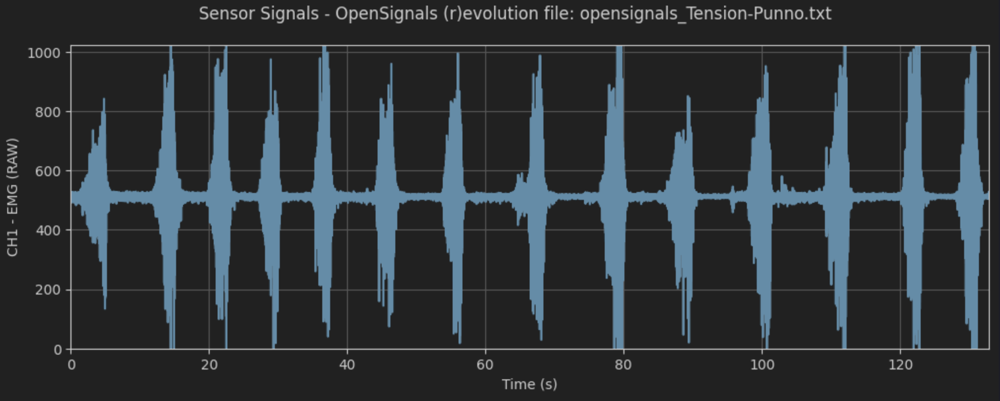

# Laboratorio 4

---

## Fotos de la experiencia
### Foto de la conexión de la experiencias 1 (Tensión de puño)

### Foto de la conexión de la experiencia 2 (Tobillo)

---

## Ploteo de las señales
### Experiencia 1

### Experiencia 2


---

## Resumen y explicaciones
### Experiencia 1

### Experiencia 2


---

## Código
```py
# Import OpenSignalsReader
from opensignalsreader import OpenSignalsReader
acq1 = OpenSignalsReader('opensignals_Tobillo-Adr.txt', show=True, raw=True)
acq2 = OpenSignalsReader('opensignals_Tension-Punno.txt', show=True, raw=True)
```
