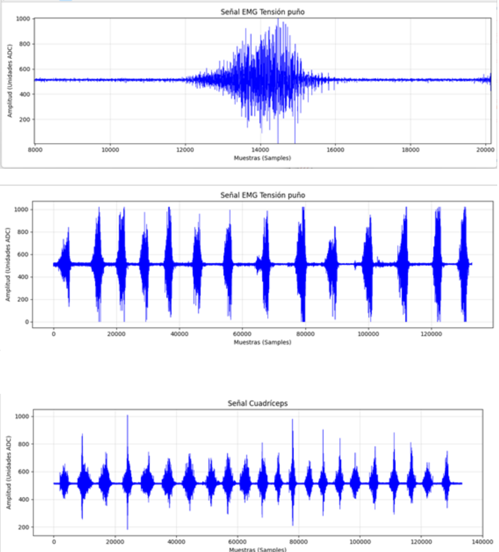
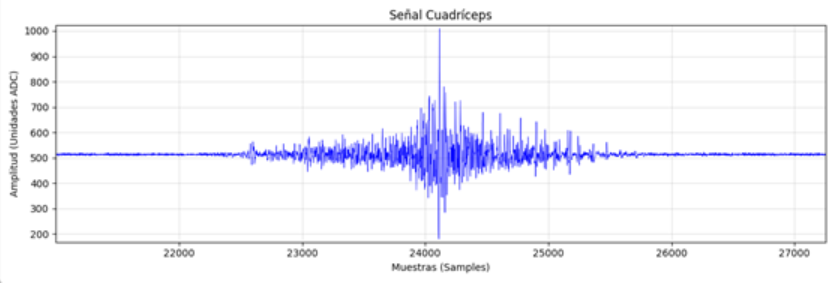

# Laboratorio 4
---

## Ploteo de las señales
### Experiencia 1


### Experiencia 2


---

## Resumen y explicaciones
### Experiencia 1

En esta experiencia se registró una señal electromiográfica (EMG) del antebrazo mientras se realizaba la acción de cerrar el puño de forma repetida. La señal fue adquirida mediante el sistema BITalino y visualizada en el software OpenSignals.

Al observar la gráfica, se puede notar que la señal presenta variaciones constantes en su amplitud a lo largo del tiempo. En los momentos donde el músculo está en reposo, la señal se mantiene relativamente estable alrededor de un valor medio. Sin embargo, cuando se realiza la contracción del puño, aparecen picos de mayor amplitud, lo que indica un incremento en la actividad muscular.

Este comportamiento se explica porque la señal EMG representa la actividad eléctrica generada por las fibras musculares. Cuando el músculo se contrae, se activan más unidades motoras, lo que produce señales eléctricas más intensas y, por lo tanto, picos más altos en la gráfica.

Además, la señal presenta un patrón repetitivo de aumento y disminución de amplitud, lo cual coincide con la acción de contraer y relajar el puño varias veces durante la medición. También se observa que la señal es irregular y algo “ruidosa”, lo cual es normal en este tipo de registros, ya que se trata de la suma de múltiples señales musculares y posibles interferencias.

En conclusión, la señal obtenida refleja adecuadamente la actividad muscular del antebrazo durante la tensión del puño, mostrando una clara relación entre el nivel de esfuerzo realizado y la amplitud de la señal registrada.

### Experiencia 2

En esta experiencia se registró la señal EMG mientras se realizaba el movimiento del tobillo de forma repetida. A diferencia de la experiencia anterior, aquí la gráfica muestra picos mucho más marcados y separados entre sí, lo que hace más fácil identificar cada movimiento.

Cuando el tobillo estaba en reposo, la señal se mantenía bastante estable alrededor de un valor medio. Pero cada vez que se realizaba el movimiento (flexión o extensión), aparecían picos altos bien definidos. Esto indica que el músculo se activaba de forma más clara y puntual en cada repetición.

Algo que llama la atención es que los picos pareciesen ser más “ordenados” y espaciados en el tiempo, lo que sugiere que el movimiento fue más rítmico. Es decir, no fue una contracción continua como en el puño, sino más bien acciones separadas, una por una.

También se puede notar que la señal baja nuevamente después de cada pico, lo que corresponde al momento en que el músculo vuelve a relajarse. Este patrón se repite varias veces, mostrando claramente el ciclo de activación y descanso del músculo.

En general, la señal refleja bien el comportamiento del músculo del tobillo durante el movimiento: cada acción genera un pico claro en la gráfica, y entre cada una hay un periodo de reposo. Esto permite diferenciar fácilmente cuándo el músculo está activo y cuándo no.

---

## Código
```py
# Import OpenSignalsReader
from opensignalsreader import OpenSignalsReader
acq1 = OpenSignalsReader('opensignals_Tobillo-Adr.txt', show=True, raw=True)
acq2 = OpenSignalsReader('opensignals_Tension-Punno.txt', show=True, raw=True)
```

---

##Homeguide
### Q1. Which are the significant frequencies for EMG acquisition? Are they the same in all body areas such as facial areas?

The relevant frequencies for long muscles are located in a specific range (50 - 150 Hz), the reason for this is the recruitment of more muscle fibers which translate in long duration of action potentials of motor units. When it comes to facial areas the muscle fibers are specialized for fine and controlled moves, the recruitment of facial muscles is faster than the big ones, the action potentials of motor units that have a short time response which translates in high frequency episodes (150 - 300 Hz).

### Q2. Which kind of filter is essential when working with EMG signals? Why do we need to apply such a filter?

To get the final signal for analysis we need to “clear” the raw one. So, first we need to apply a reject band filter (High-Pass) which will help us to avoid contaminated lectures by noise made for erratic movements of patients or problems with wires (0 - 20 Hz). And the final step is to apply a band-pass filter, for biomedical applications the recommended filter is a Butterworth (4th order) because the band-pass does not present oscillations which means that the amplitude of frequencies will not be affected.

### Q3. How does the amplitude differ in each muscular contraction? Is there a difference for body locations?


The amplitude of an EMG signal increases in proportion to the intensity of the muscular contraction, as a higher force requirement triggers the recruitment of more motor units and increases their firing frequency. In the analyzed data captured via BITalino, the forearm's EMG (fist tension) displays a significantly higher amplitude and more consistent peak saturation compared to the quadriceps' EMG.

While the quadriceps is a larger muscle group, the recorded electrical activity at the skin surface is lower in this instance. This difference between anatomical sites is primarily due to signal attenuation caused by the “volume conductor effect”. The signal amplitude is heavily influenced by the thickness of the subcutaneous fat and skin layers, which act as a low-pass filter, attenuating the high-frequency components and reducing the voltage before it reaches the surface electrodes.

### Q4. Show a screenshot of a relevant portion of Electromyography (EMG) data within the experiment proposed on Section D of a muscle of interest. Does this signal correspond to what you expected? Why? Which emotion and action did you perform to trigger the muscle? Which muscle did you trigger?


A relevant portion of the EMG data for the Quadriceps Femoris (Section D) shows a stable baseline at approximately 500 ADC units during rest, followed by a dense "burst" of high frequency activity where the signal oscillates rapidly during the contraction phase. This signal corresponds perfectly to expectations because it captures the synchronized depolarization of muscle fiber membranes required to perform the action of knee extension. While the quadriceps extension is a functional physical movement typically performed with a neutral or focused emotion, the electrical burst reflects the high motor effort required to move the weight of the lower limb against its own gravity.

### Q5. To the best of your knowledge, does the EMG amplitude equal to the amount of force that you have generated with your muscle?

The EMG amplitude is not directly equal to the amount of mechanical force generated, but they share a strong correlation. While an increase in effort usually leads to a higher EMG amplitude, this relationship is often non-linear and can be confounded by factors such as muscle fatigue (where the electrical signal may actually increase as the brain recruits more motor units to compensate for tired fibers that are producing less actual force). Furthermore, because EMG measures electrical potential rather than mechanical tension, variables like electrode placement, skin impedance, and the change in muscle shape during contraction reinforce that the voltage recorded cannot be used as a proportional substitute for a force measurement.
