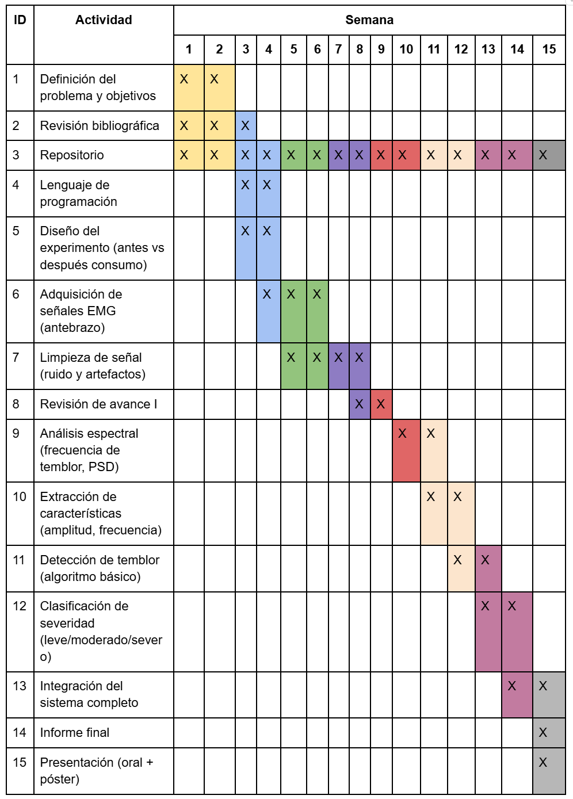

# Adquisición y procesamiento de señales EMG para la cuantificación del temblor neuromuscular en mano y antebrazo tras el consumo de bebidas energéticas

## INTRODUCCIÓN

En la actualidad el consumo de bebidas energéticas por parte de la población joven en el Perú ha determinado un crecimiento anual estimado de hasta un 7,1 % durante al menos unos 9 años [1]. Los estudios estadísticos del 2025 afirman que el 60% de los jóvenes (media de 18 años) consume o ha consumido bebidas energéticas por fines académicos o deportivos [2].

Las consecuencias médicas si bien no son relevantes y notorias inicialmente, tienden a agravarse cuando el consumo es constante y desinformado.

Para entender el proceso fisiológico es necesario aclarar que la mayoría de bebidas de esta categoría el ingrediente principal es la cafeína, de la cual nos basaremos para explicar el mecanismo de acción en el sistema nervioso de las bebidas energéticas. Para un efecto mucho más completo y real es necesario tener en cuenta el resto de componentes de las bebidas y cómo interactúan entre sí cuando son ingeridas. En síntesis, la cafeína posee una estructura molecular muy similar a la adenosina, la cual nos permite sentir cansancio, es por esto que “suprimimos” esa sensación. Tras este evento de reemplazar a la adenosina surgen eventos en cascada que produce finalmente la liberación de dopamina, glutamato y por consecuencia, adrenalina. Ese desencadenante provoca el aumento de la tasa cardiaca y la presión arterial, también fasciculaciones musculares.

El objetivo principal entonces es caracterizar y cuantificar señales EMG para un análisis posterior e identificar qué factores fisiológicos están relacionados con los episodios de temblor neuromuscular debido al consumo de bebidas energéticas.

---

## PROBLEMÁTICA A ABORDAR

Diversos estudios indican que estas bebidas representan una parte importante del consumo de cafeína en la población joven, lo que hace que estén más expuestos a sus efectos en el cuerpo [3], [4]. Sin embargo, el problema radica no solo en la cafeína, sino en cómo se consume. Muchas veces se toman de manera rápida, en grandes cantidades o sin considerar otras fuentes de cafeína en el día, como café o gaseosas.

Desde el punto de vista de la salud, se ha reportado que el consumo de bebidas energéticas está asociado a efectos como insomnio, nerviosismo y temblores en las manos. Un metaanálisis con más de 96,000 personas mostró que quienes consumen estas bebidas tienen mayor probabilidad de presentar estos síntomas en comparación con los no consumistas [5]. Además, la cantidad de cafeína puede variar bastante entre productos, pudiendo ir desde 50 hasta más de 500 mg por envase, lo que hace más difícil que las personas controlen cuánto consumen realmente [5].

A pesar de esto, muchas personas no son completamente conscientes de cómo estas bebidas afectan su cuerpo. Sí pueden notar “estar más nerviosos” o que les tiemblan las manos, pero estos efectos suelen quedarse en una percepción superficial y no se llegan a medir de forma objetiva.

La relevancia de este problema aumenta al considerar que el temblor puede comprometer actividades cotidianas que requieren precisión. Esto es especialmente importante en estudiantes y profesionales, donde el control de la mano es clave para un buen desempeño. Estudios han demostrado que la cafeína puede incrementar significativamente el temblor en tareas de precisión, afectando el rendimiento motor fino [6]. En este sentido, el antebrazo tiene un rol importante, ya que contiene los músculos responsables del control de los movimientos finos de la mano y los dedos [9]. Debido a esta alta demanda de control motor, es posible que los efectos de la hiperexcitación neuromuscular, como el temblor inducido por estimulantes, se manifiesten mayormente en esta región.

Sin embargo, actualmente no existen herramientas simples y accesibles que permitan medir de manera objetiva estos cambios en la actividad muscular. La evaluación del temblor suele basarse en la percepción del individuo o en observaciones clínicas, lo que puede llevar a una subestimación del problema y limitar la toma de decisiones informadas sobre el consumo de bebidas energéticas.

### Problemática técnica

A pesar de su importancia en el área clínica, la cuantificación del temblor inducido por sustancias estimulantes (como, en este caso, la cafeína presente en bebidas energéticas) enfrenta varios desafíos técnicos críticos, concretamente en el procesamiento de señales de electromiografía de superficie o sEMG. La señal sEMG es inherentemente estocástica, lo que complica la estimación robusta de la potencia en bandas de frecuencia específicas y altera el comportamiento espectral esperado ante la hiperexcitabilidad de las unidades motoras [3].

Un obstáculo metodológico principal es la interferencia de los artefactos de movimiento en el mismo rango de las frecuencias bajas (4–15 Hz) propias del temblor neuromuscular. Esto complica la tarea de diferenciar entre el movimiento voluntario y los temblores involuntarios si no se utilizan algoritmos de filtrado adaptativo [4], [5].

Además, la implementación de sistemas de adquisición de bajo costo aumenta la susceptibilidad al ruido electromagnético y degrada la pureza de la señal, limitando la fiabilidad del análisis de densidad espectral de potencia (PSD) para la extracción de características biomarcadoras [8], [9].

Finalmente, la falta de protocolos de procesamiento digital estandarizados para la segmentación y limpieza de datos genera una brecha tecnológica que impide generar un índice cuantitativo preciso que correlacione la dosis de estimulantes con el grado de inestabilidad motora en el antebrazo [6], [7].

---

## PROPUESTA DE SOLUCIÓN

### Desarrollo de un dispositivo portátil de electromiografía (EMGs) para cuantificación objetiva del temblor

Se propone el diseño de un dispositivo wearable de bajo costo, ubicado en el antebrazo, capaz de adquirir señales de electromiografía de superficie (sEMG) para registrar la actividad muscular asociada al temblor neuromuscular.

A diferencia de las soluciones existentes reportadas, donde solo se realiza la adquisición de señal, el sistema busca integrar una etapa de procesamiento digital (para filtración de ruidos y artefactos), el análisis espectral de la señal y la extracción de características relevantes.

La evaluación se realizará mediante un protocolo comparativo antes y después del consumo de bebidas energéticas, con el objetivo de correlacionar los cambios en la actividad muscular con la ingesta de bebidas energéticas.

Para los fines del curso, el enfoque principal se centrará en el desarrollo y validación del algoritmo de procesamiento y análisis de la señal sEMG, priorizando la detección y clasificación del temblor. La implementación de hardware se considerará a nivel conceptual o como plataforma de adquisición, sin profundizar en su optimización.

---

## PLAN DE ACTIVIDADES

---

## REFERENCIAS

[1] Informes de Expertos, "Mercado de Bebidas Energizantes en Perú...", 2026.  
[2] "Moda o riesgo: el 60% de los jóvenes consume bebidas energéticas," Salud con lupa, 2024.  
[3] S. Breda et al., *Frontiers in Public Health*, 2014.  
[4] EFSA, *Opinión científica sobre la seguridad de la cafeína*, 2015.  
[5] S. Visram et al., *BMJ Open*, 2016.  
[6] S. M. Al-Hadithy et al., *Surgical Neurology International*, 2013.  
[7] R. S. Levangie y C. C. Norkin, 2011.  
[8] Deuschl et al., 2019.  
[9] Kahathuduwa et al., 2016.  
[10] Rissanen, 2011.  
[11] Li et al., 2024.  
[12] Smith, 2021.  
[13] Zhu et al., 2023.  
[14] Neural Rehabilitation Group.
